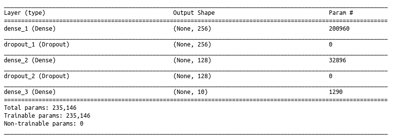

```{r package_options, include=FALSE}
knitr::opts_knit$set(progress = FALSE, verbose = TRUE)
```


# Fully connected layers


Vamos a utilizar la librería 

#### [__KERAS__](https://keras.rstudio.com/)


## instalación

Keras utiliza como backend __TensorFlow__. Para poner todo en funcionamiento necesitamos instalar ambas cosas. Para eso usamos la función `install_keras()` que realiza una instalación por default de basada en el CPU.

Si tienen una GPU (procesador gráfico), las redes funcionan mucho más rápido, porque la GPU permite optimizar las operaciones matriciales. Pero necesitan instalar keras para que corra en el lenguaje de la GPU ( _CUDA_ )


```{r}
# devtools::install_github("rstudio/keras")
library(keras)
# install_keras()
library(tidyverse)
library(knitr)
```


## Mnist

Este es un problema clásico, de juguete, que sirve desde hace muchos años como benchmark para clasificación de imágenes. 
Tiene 60.000 imágenes, de 28x28, de números escritos a mano.

```{r}
mnist <- dataset_mnist()
x_train <- mnist$train$x
y_train <- mnist$train$y
x_test <- mnist$test$x
y_test <- mnist$test$y
```


Veamos la pinta de los datos

__datos de entrada__

```{r}
matrix.rotate <- function(img) { 
    t(apply(img, 2, rev))
}

par(mfrow=c(3, 3))
for (idx in 1:9) {
    label <- y_train[idx]
    image(matrix.rotate(x_train[idx,,]), col = grey(level = seq(1, 0, by=-1/255)), axes=F, main=label)
  
}
```


> Pará pará pará... vos me querés decir que ahora cada observación es una matriz de 28x28?

> SI


- En estadística y Machine Learning estamos acostumbrados a pensar cada observación como una fila, con features en las columnas. Si queremos representar una imagen tenemos que _aplanarla_. Esto significa que tendríamos 28x28=784 features. Probablemente a continuación necesitaríamos una técnica de reducción de la dimensionalidad, y por ahí seguimos...

- En las redes neuronales esto cambia. Si bien en el modelo de hoy (Fully conected layers) la capa de entrada sigue teniendo 784 nodos, la estructura de la red permite captar muy bien las relaciones no lineales propias de una imagen. 

- Incluso más, cuando veamos las Convolutional Neural Networks, vamos a utilizar imagenes a color, lo que implica 3 matrices para los 3 canales de color (RGB)


__¿qué pinta tiene un gráfico desde el punto de vista matricial?__


```{r}
kable(data.frame(x_train[1,,]))
```


Cada valor representa a un pixel, y su valor es su representación en la escala de grises (de 0 a 255). Es decir, cuando mayor es el valor, eso es un pixel más oscuro. 

El dato esta en un array de 3 dimensiones (imagen,ancho,largo). Como tenemos 60K imagenes, esto tiene la forma de :

```{r}
dim(x_train)
```


Es decir, nuestros datos ahora conforman un Tensor:

![Tensor^[https://hackernoon.com/learning-ai-if-you-suck-at-math-p4-tensors-illustrated-with-cats-27f0002c9b32]](img/Tensor.jpeg)


Como mencionabamos arriba lo primero es un _reshape_ de los datos:

- Pasar de estos arrays de 3 dimensiones a 2 dimensiones (como estamos acostumbrados, un vector por observación)
- Además, necesitamos convertir la escala de los datos de íntegers entre 0 y 255 a numeros floating point entre 0 y 1

```{r}
# reshape
x_train <- array_reshape(x_train, c(nrow(x_train), 28*28)) #la primera dimensión es tan larga como la cantidad de observaciones, la segunda dimensión es la matriz aplanada (28*28)
x_test <- array_reshape(x_test, c(nrow(x_test), 28*28))
# rescale
x_train <- x_train / 255
x_test <- x_test / 255
```


obs: esto lo podríamos hacer con `dim <-`, pero sería menos performante.


__datos de salida__

```{r}
y_train %>% head(.)
```

Es un vector de integers entre 0-9. 

Dada la implementación de las redes, necesitamos pasarlo a __one-hot encoding__ esto se hace con la función `to_categorical()` de Keras


```{r}
y_train <- to_categorical(y_train, 10)
y_test <- to_categorical(y_test, 10)
```


¿qué pinta tiene esto?

```{r}
y_train %>% head(.)
```


## Definción del modelo


Para armar el modelo primero definimos el tipo de modelo. Para eso usamos `keras_model_sequential()` que nos permite simplemente apilar capas de la red. 

- En la primera capa tenemos que aclarar el input_shape. En este caso el unidimensional (lo aplanamos recién), pero podría ser un tensor de cualquier dimensión (!!)
- Las capas se agregan con pipes `%>%`
- La última capa tiene la misma cantidad de unidades que categorías nuestro output. La salida del modelo es un vector que asigna una probabilidad a cada una da las categorías
- En cada capa tenemos que definir una función de activación
- Además agregamos una regularización `layer_droput(x)` que lo que hace es, en cada iteración del ajuste, ignorar el x% de las conexiones. Esto evita el sobreajuste del modelo

```{r}

model <- keras_model_sequential() 
model %>% 
  layer_dense(units = 256, activation = 'relu', input_shape = c(784)) %>% 
  layer_dropout(rate = 0.4) %>% 
  layer_dense(units = 128, activation = 'relu') %>%
  layer_dropout(rate = 0.3) %>%
  layer_dense(units = 10, activation = 'softmax')
```


#### Funciones de activación

Para este modelo utilizamos dos funciones de activación: 

- Rectified Linear Unit: $$f(x)=max(0,x)$$
- Softmax : $$ f(x)=\frac{e^{x_i}}{\sum_{j=1}^n e^{x_j}}$$

Definidas en código y gráficamente:

```{r}

relu <- function(x) ifelse(x >= 0, x, 0)
softmax <- function(x) exp(x) / sum(exp(x))

data.frame(x= seq(from=-1, to=1, by=0.1)) %>% 
  mutate(softmax = softmax(x),
         relu = relu(x)) %>% 
  gather(variable,value,2:3) %>% 

ggplot(., aes(x=x, y=value, group=variable, colour=variable))+
  geom_line(size=1) +
  ggtitle("ReLU & Softmax")+
  theme_minimal()
```


__ReLu__ es la función de activación que más se utiliza en la actualidad. 

Si queremos ver un resumen del modelo:

```{r echo=T, results='hide',eval=F}
summary(model)
```




El modelo tiene 235,146 parámetros para optimizar:

En la primera capa oculta tenemos 256 nodos que se conectan con cada nodo de la capa de entrada (784), además de un bias para cada nodo:
```{r}
784*256+256
```

La capa de droput es una regularización y no ajusta ningún parámetro

la capa densa 2 se conecta con los 256 nodos de la primera capa:

```{r}
128*256+128
```

La tercera capa
```{r}
128*10+10
```

-----------

Luego necesitamos __compilar el modelo__ indicando la función de _loss_, qué tipo de optimizador utilizar, y qué métricas nos importan

```{r}
model %>% compile(
  loss = 'categorical_crossentropy',
  optimizer = optimizer_rmsprop(),
  metrics = c('accuracy')
)
```


## Entrenamiento

Para ajustar el modelo usamos la función `fit()`, acá necesitamos pasar los siguientes parámetros:

- El array con los datos de entrenamiento
- El array con los outputs
- `epochs`: Cuantas veces va a recorrer el dataset de entrenamiento
- `batch_size`: de a cuantas imagenes va a mirar en cada iteración del backpropagation
- `validation_split`: Hacemos un split en train y validation para evaluar las métricas.

```{r echo=T, results='hide',eval=F}
fit_history <- model %>% fit(
  x_train, y_train, 
  epochs = 30, batch_size = 128, 
  validation_split = 0.2
)
```


```{r include=FALSE, eval=F}
#guardo la historia. No lo muestro, ni lo corro por default
saveRDS(fit_history,"../Resultados/fc_hist.RDS")
```

```{r include=FALSE, eval=T}
#levanto la historia. No lo muestro, pero lo corro por default
fit_history <- read_rds("../Resultados/fc_hist.RDS")
```


Mientras entrenamos el modelo, podemos ver la evolución en el gráfico interactivo que se genera en el viewer de Rstudio.

`fit()` nos devuelve un objeto que incluye las métricas de loss y accuracy

```{r}
fit_history
```

Este objeto lo podemos graficar con `plot()` y nos devuelve un objeto de _ggplot_, sobre el que podemos seguir trabajando

```{r}
plot(fit_history)+
  theme_minimal()+
  labs(title= "Evolución de Loss y Accuracy en train y validation")
```


> Noten que el modelo entrenado, con el que podemos predecir, sigue siendo `model`.

__es importante guardar el modelo luego de entrenar, para poder reutilizarlo__


```{r eval=FALSE, echo=T}
model %>% save_model_hdf5("../Resultados/fc_model.h5")
```

y para cargarlo

```{r}
modelo_preentrenado <- load_model_hdf5("../Resultados/fc_model.h5")
```

```{r}
modelo_preentrenado
```

Si queremos evaluar el modelo sobre el conjunto de test (distinto del de validación) podemos usar la función `evaluate()`

```{r}
modelo_preentrenado %>% evaluate(x_test, y_test)
```

Para obtener las predicciones sobre un nuevo conjunto de datos utilizamos `predict_classes()`

```{r}
modelo_preentrenado %>% predict_classes(x_test) %>% head(.)
```


## Otros recursos interesantes:

[Visualización de una Red Fully conected para clasificación de dígitos](http://scs.ryerson.ca/~aharley/vis/fc/)


[Tensor Flow Playground](http://playground.tensorflow.org/#activation=tanh&batchSize=10&dataset=circle&regDataset=reg-plane&learningRate=0.03&regularizationRate=0&noise=0&networkShape=4,2&seed=0.59794&showTestData=false&discretize=false&percTrainData=50&x=true&y=true&xTimesY=false&xSquared=false&ySquared=false&cosX=false&sinX=false&cosY=false&sinY=false&collectStats=false&problem=classification&initZero=false&hideText=false
)


[Diagramas de redes](http://alexlenail.me/NN-SVG/index.html)


