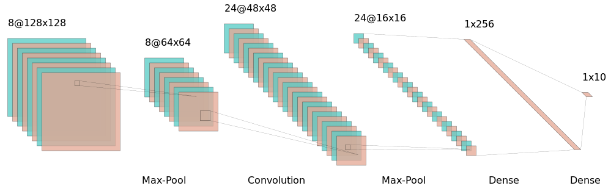
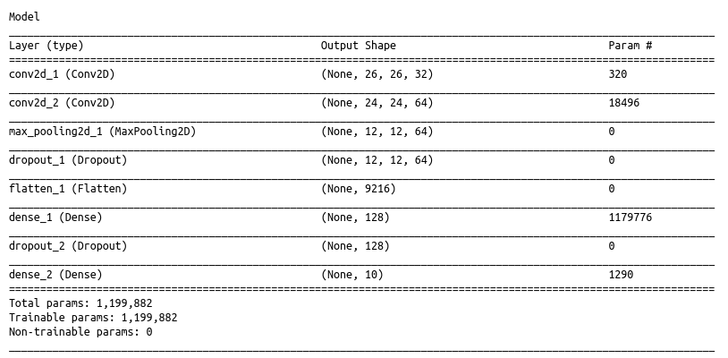
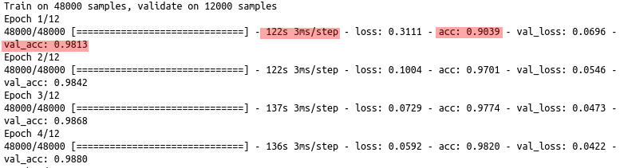

```{r package_options, include=FALSE}
knitr::opts_knit$set(progress = TRUE, verbose = TRUE)
```

# Convolutional Neural Networks




Vamos a utilizar la librería 

#### [__KERAS__](https://keras.rstudio.com/)

```{r}
# devtools::install_github("rstudio/keras")
library(keras)
# install_keras()
library(tidyverse)
library(knitr)
```


## Mnist

Vamos a utilizar nuevamente el dataset de MNIST de la clase de _fully connected layers_

```{r}
mnist <- dataset_mnist()
x_train <- mnist$train$x
y_train <- mnist$train$y
x_test <- mnist$test$x
y_test <- mnist$test$y
```


Recordemos la pinta de los datos

__datos de entrada__

```{r}
matrix.rotate <- function(img) { 
    t(apply(img, 2, rev))
}

par(mfrow=c(3, 3))
for (idx in 1:9) {
    label <- y_train[idx]
    image(matrix.rotate(x_train[idx,,]), col = grey(level = seq(1, 0, by=-1/255)), axes=F, main=label)
  
}
```


El dato esta en un array de 3 dimensiones (imagen,ancho,largo). Como tenemos 60K imágenes, esto tiene la forma de :

```{r}
dim(x_train)
```


Dimensiones del problema: 

Definamos como variables las siguientes dimensiones del problema (nos facilita la reutilización del código):

- número de clases
- largo de las imágenes
- ancho de las imágenes

```{r}
num_classes <- 10
img_rows <- 28
img_cols <- 28
```


### Data shape

En un problema normal de clasificación para Machine Learning tenemos 2 dimensiones: _filas y columnas_, donde la 1° representa las observaciones y la segunda la secuencia de features. 

En el caso de las redes convolucionales necesitamos datos de 4 dimensiones:

1. observaciones
2. largo de la imagen(o matriz)
3. ancho de la imagen (o matriz)
4. dimensión del color: en imágenes normales a color: RGB, esta dimensión tiene extensión de 3, por los tres canales de color. En imágenes de blanco y negro, la dimensión es de extensión 1. 

```{r}
x_train <- array_reshape(x_train, c(nrow(x_train), img_rows, img_cols, 1))
x_test <- array_reshape(x_test, c(nrow(x_test), img_rows, img_cols, 1))
input_shape <- c(img_rows, img_cols, 1)
```

- Además, necesitamos convertir la escala de los datos de íntegers entre 0 y 255 a números floating point entre 0 y 1

```{r}

x_train <- x_train / 255
x_test <- x_test / 255

```

```{r}
cat('x_train_shape:', dim(x_train), '\n')
cat(nrow(x_train), 'train samples\n')
cat(nrow(x_test), 'test samples\n')

```


__datos de salida__

necesitamos pasarlo a __one-hot encoding__ esto se hace con la función `to_categorical()` de Keras

```{r}
y_train <- to_categorical(y_train, num_classes)
y_test <- to_categorical(y_test, num_classes)
```

## Definción del modelo


Para armar el modelo primero definimos el tipo de modelo. Para eso usamos `keras_model_sequential()` que nos permite simplemente apilar capas de la red. 

- En la primera capa tenemos que aclarar el input_shape.
- Las capas se agregan con pipes `%>%`
- La última capa tiene la misma cantidad de unidades que categorías nuestro output. La salida del modelo es un vector que asigna una probabilidad a cada una da las categorías
- En cada capa tenemos que definir una función de activación
- Además agregamos una regularización `layer_droput(x)` que lo que hace es, en cada iteración del ajuste, ignorar el x% de las conexiones. Esto evita el sobreajuste del modelo

```{r}

model <- keras_model_sequential() %>%
  layer_conv_2d(filters = 32, kernel_size = c(3,3), activation = 'relu',
                input_shape = input_shape) %>% 
  layer_conv_2d(filters = 64, kernel_size = c(3,3), activation = 'relu') %>% 
  layer_max_pooling_2d(pool_size = c(2, 2)) %>% 
  layer_dropout(rate = 0.25) %>% 
  layer_flatten() %>% 
  layer_dense(units = 128, activation = 'relu') %>% 
  layer_dropout(rate = 0.5) %>% 
  layer_dense(units = num_classes, activation = 'softmax')


```


La arquitectura de esta red es básicamente la siguiente:

1. __Convolución__: 32 filtros (se achica la imagen original, y se multiplica en 32)
2. __Convolución__: 64 filtros (se vuelve a achicar y cada resultado del filtro se multiplica por 64)
3. __max_pooling__: Se achican las imágenes
4. __dropout__: se regulariza para evitar overfitting
5. __flatten__: Se aplanan los inputs para poder pasarlos a una red densa
6. __dense__: capa densa con 128 neuronas
7. __dropout__: se vuelve a regularizar
8. __dense__ : capa de salida, con tantas neuronas como clases y una activación softmax (para que devuelva probabilidades)


### `layer_conv_2d`

![convolución^[http://www.tbluche.com/files/MeetupSaoPaulo2017.pdf]](img/convolution.png)


- La capa de convoluciones construye pequeños _filtros_ o _kernels_ de la dimensión `kernel_size()` que pasan por el input original realizando una _convolución_. 

- El filtro _barre_ la imagen original, moviéndose de a `strides()` posiciones. Por default se mueve de a 1 lugar.

- Notemos que si el filtro es de 3x3 y el stride es 1, entonces la imagen original va a perder 2 pixels de largo y 2 pixels de ancho.


### `layer_max_pooling_2d`

![max pooling^[https://computersciencewiki.org/index.php/File:MaxpoolSample2.png]](img/MaxpoolSample2.png)

- Es max pooling es una forma de reducir el tamaño de la matrix.

- Al igual que la convolución, _barre_ la imagen con una ventana de `pool_size()` moviéndose de a `stride()` posiciones, y devuelve el valor más alto. 

- Un `pool_size()` de 2x2 nos reduce el tamaño de la imagen a la mitad.

### `layer_dropout`

![Dropout^[http://jmlr.org/papers/volume15/srivastava14a.old/srivastava14a.pdf]](img/dropout.png)

- El dropout es un método de regularización donde para cada iteración del backpropagation, anula el ajuste para una `rate` proporción de los pesos. De esta forma, no se ajusta todo todo el tiempo, reduciendo los grados de libertad del modelo, y evitando el overfitting


### `layer_flatten`

![flatten^[https://rubikscode.net/2018/02/26/introduction-to-convolutional-neural-networks/]](img/flatten.png)


- Esta layer lo único que hace es un reshape para que los datos puedan ser utilizados por una capa densa.


### `layer_dense`


- La capa densa es una _fully connected layer_ que recibe como input el producto aplanado de las capas previas.


#### Funciones de activación

Para este modelo utilizamos las mismas dos funciones de activación que utilizamos en la FC nn: 

- Rectified Linear Unit: $$f(x)=max(0,x)$$
- Softmax : $$ f(x)=\frac{e^{x_i}}{\sum_{j=1}^n e^{x_j}}$$

Definidas en código y gráficamente:

```{r}

relu <- function(x) ifelse(x >= 0, x, 0)
softmax <- function(x) exp(x) / sum(exp(x))

data.frame(x= seq(from=-1, to=1, by=0.1)) %>% 
  mutate(softmax = softmax(x),
         relu = relu(x)) %>% 
  gather(variable,value,2:3) %>% 

ggplot(., aes(x=x, y=value, group=variable, colour=variable))+
  geom_line(size=1) +
  ggtitle("ReLU & Softmax")+
  theme_minimal()
```


__ReLu__ es la función de activación que más se utiliza en la actualidad. 

#### Parametros entrenables del modelo


```{r echo=T, results='hide',eval=F}
model
```




- Cada vez que el modelo pasa por una convolución


El modelo tiene 1.2 millones de parámetros para optimizar:

La primera capa convolucional tiene que entrenar los filtros. Como estos eran de 3x3, cada uno tiene 9 parámetros para entrenar + 1 bias por filtro

```{r}
32* (3*3) +32

```


La segunda convolución tiene que entrenar kernels de 3x3 para 64 filtros $64*(3*3)$, para cada uno de los 32 filtros de la capa anterior, +1 bias por filtro

```{r}
64*(3*3)*32 +64
```

 `layer_max_pooling_2d`, `layer_dropout` y `layer_flatten` no entrenan parámetros.
 
 cuando aplanamos. El shape pasa a:
 
```{r}
12*12*64
```
 
 
- La  primera capa densa tienen que conectar 9216 nodos con los 128, más los 128 bias.
- La capa de salida tiene que conectar los 128 nodos con los 10 de salida, más 10 bias

```{r}
128*9216 +128
128*10 +10
```

---------

Luego necesitamos __compilar el modelo__ indicando la función de _loss_, qué tipo de optimizador utilizar, y qué métricas nos importan

```{r}

model <- model %>% compile(
  loss = "categorical_crossentropy",
  optimizer = optimizer_adadelta(),
  metrics = c('accuracy')
)
```

## Entrenamiento

Para ajustar el modelo usamos la función `fit()`, acá necesitamos pasar los siguientes parámetros:

- El array con los datos de entrenamiento
- El array con los outputs
- `epochs`: Cuantas veces va a recorrer el dataset de entrenamiento
- `batch_size`: de a cuantas imágenes va a mirar en cada iteración del backpropagation
- `validation_split`: Hacemos un split en train y validation para evaluar las métricas.

```{r echo=T, results='hide',eval=F}

epochs <- 12
batch_size <- 128
validation_split <- 0.2

fit_history <- model %>% fit(
  x_train, y_train,
  batch_size = batch_size,
  epochs = epochs,
  validation_split = validation_split
)


```
Mientras entrenamos el modelo, podemos ver la evolución en el gráfico interactivo que se genera en el viewer de Rstudio.





```{r include=FALSE, eval=F}
#guardo la historia. No lo muestro, ni lo corro por default
saveRDS(fit_history,"../Resultados/cnn_hist.RDS")
```

```{r include=FALSE, eval=T}
#levanto la historia. No lo muestro, pero lo corro por default
fit_history <- read_rds("../Resultados/cnn_hist.RDS")
```


```{r}
fit_history
```


`fit()` nos devuelve un objeto que incluye las métricas de loss y accuracy.

Este objeto lo podemos graficar con `plot()` y nos devuelve un objeto de _ggplot_, sobre el que podemos seguir trabajando

```{r}
plot(fit_history)+
  theme_minimal()+
  labs(title= "Evolución de Loss y Accuracy en train y validation")
```


__es importante guardar el modelo luego de entrenar, para poder reutilizarlo__


```{r eval=FALSE, echo=T}
model %>% save_model_hdf5("../Resultados/cnn_model.h5")
```

y para cargarlo

```{r}
modelo_preentrenado <- load_model_hdf5("../Resultados/cnn_model.h5")
```

```{r}
modelo_preentrenado
```


Si queremos evaluar el modelo sobre el conjunto de test (distinto del de validación) podemos usar la función `evaluate()`


```{r}

modelo_preentrenado %>% evaluate(x_test, y_test)
```

Para obtener las predicciones sobre un nuevo conjunto de datos utilizamos `predict_classes()`

```{r}
modelo_preentrenado %>% predict_classes(x_test) %>% head(.)
```


-------

Otros recursos interesantes:


[Visualización de una Red Fully conected para clasificación de dígitos](http://scs.ryerson.ca/~aharley/vis/conv/)


[Tensor Flow Playground](http://playground.tensorflow.org/#activation=tanh&batchSize=10&dataset=circle&regDataset=reg-plane&learningRate=0.03&regularizationRate=0&noise=0&networkShape=4,2&seed=0.59794&showTestData=false&discretize=false&percTrainData=50&x=true&y=true&xTimesY=false&xSquared=false&ySquared=false&cosX=false&sinX=false&cosY=false&sinY=false&collectStats=false&problem=classification&initZero=false&hideText=false
)

